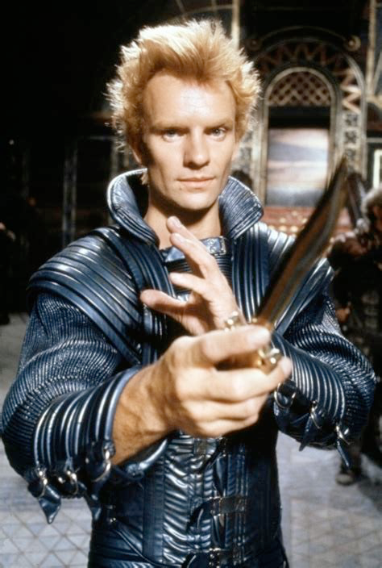
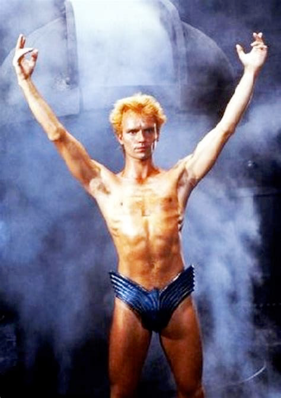

## Character Details

* Character Name: Alabama Morrison - [PDF](<Alabama the Shark - playbook.pdf>)
* Player Name: Todd Bradley
* Playbook: Shark
* Look: Spiky hair, looks like Sting in Dune
* Background: Escaped - Family was captured by rival faction; escaped 5 years later
* Taboo: Cannabilism - Survived "the lean times" without resorting to cannabilism
* Deals with Vice through Pleasure - Unwinds via carnal pleasures

### Hooks

* Enemy: Leo, a mutant. (put more detail here)
* Friend: Buddy, a mariachi. (put more detail here)

### Photos

Alabama Fights!

Alabama Deals!

Alabama was a captive for 5 years

