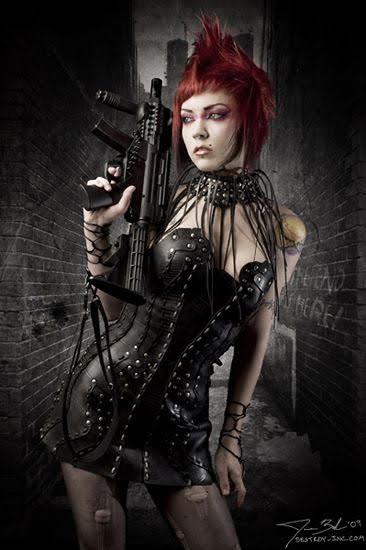
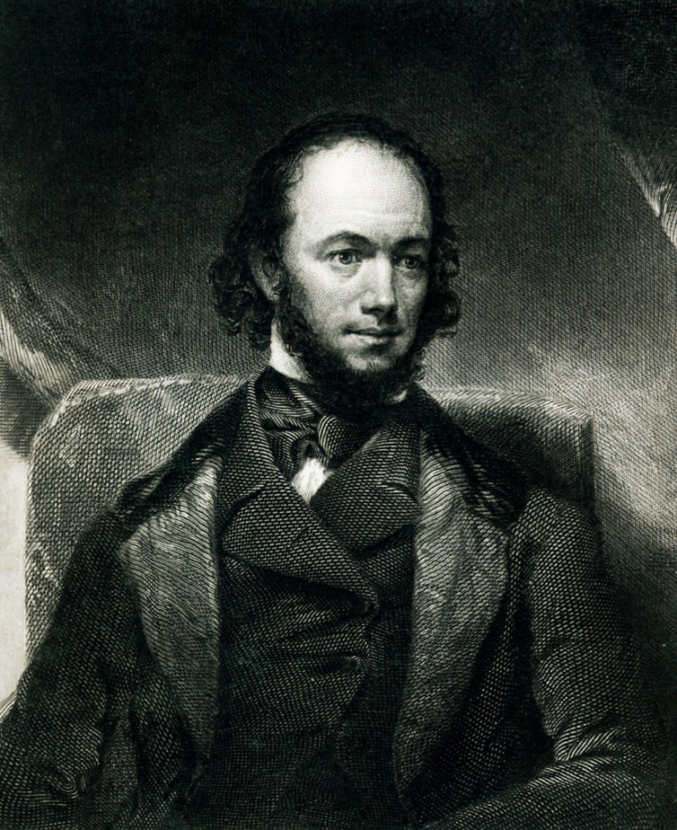
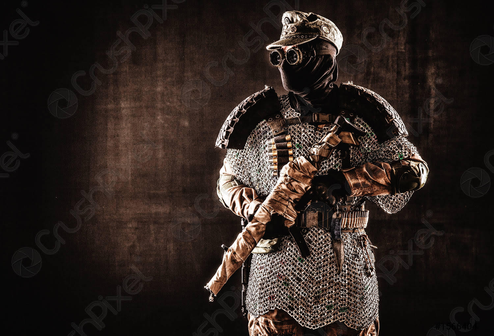
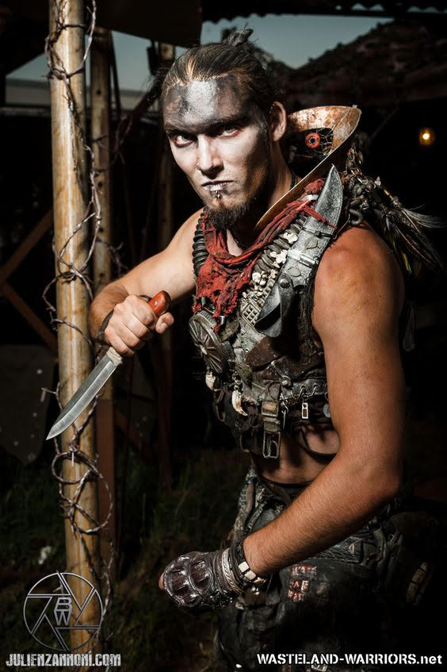
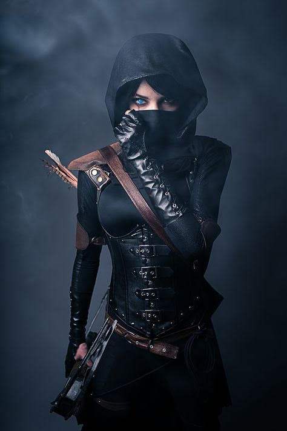
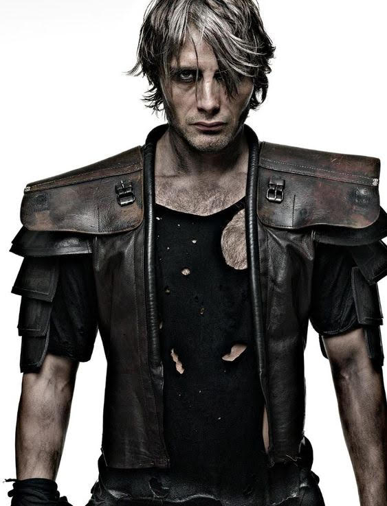

## Current Status

Tier: IV

## Description

From the Glow in the Dark rule book:

> Travelers on the road at night can often mark their progress by Hightower’s torches, spotlights, and neon. Queen Capital VIII, who traces her august lineage back to the great monarch Capital the First, reigns over multiple levels of barter and grift in a high-rise rebuilt and given over to progress and decadence. It is rumored that the Conclave have some sort of trade agreement with Hightower, given how easily it has fended off attacks from the Last Cavalry in the past. However, Blacksand’s growth as a trade nexus is a concern that Queen Capital cannot ignore for much longer.

> **Turf**: A high-rise in the Boneyard and the surrounding blocks. Many trade roads, outposts, and informants.

> **NPCs**: Queen Capital VIII (narcissistic, shrewd, sociopath) 

> **Allies**: The Conclave, Seekers

> **Enemies**: The Last Cavalry, Blacksand 
> 
> **Situation**: Hightower wants a monopoly. Anyone who slings scrap in the Boneyard already kicks up to Queen Capital and her soldiers, but she wants more - starting with Blacksand.

## Individuals of Note

### Queen Capital VIII

narcissistic, shrewd, sociopath

### Ryse the Scrap Lord

the discerning and suspicious but intuitive chief merchant and treasurer

### Pak the Death Squad Captain and Field Commander

meticulous, callous

### Scar the Beast Master

mutant animal trainer

### Ping the Sword Mistress

the queen's body guard

### Lord Martin the Head of Palace Security

grim and unforgiving

